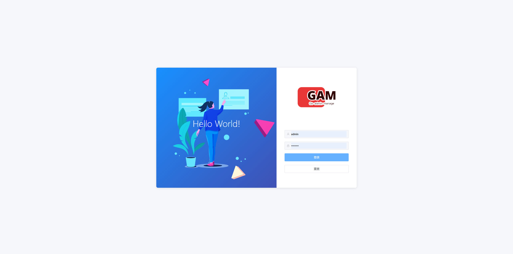
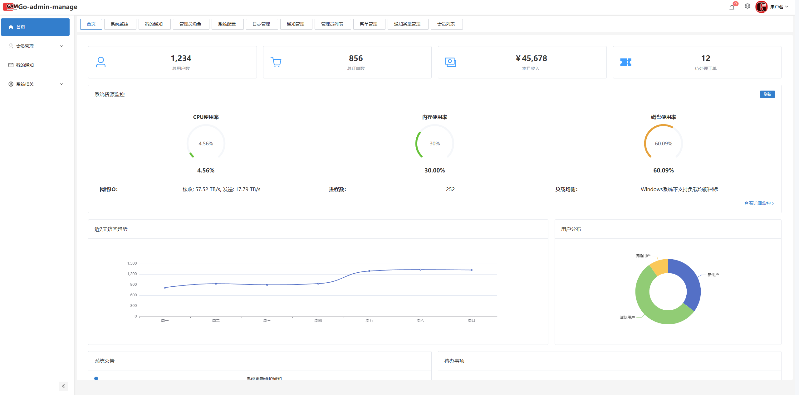
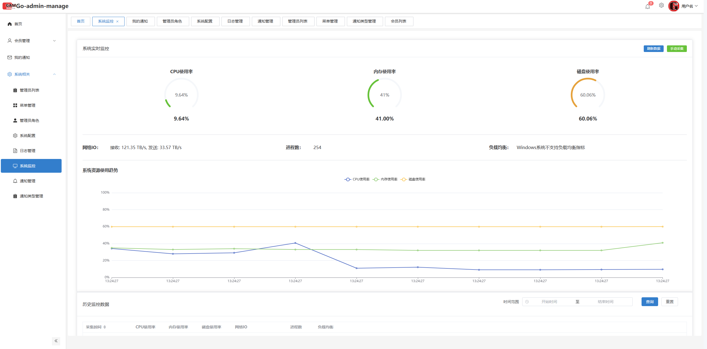

# GolangAdminManage
 项目文档

## 项目简介
GolangAdminManage 是一个基于 Golang + Vue3 的后台管理系统框架，采用前后端分离架构。这个项目不仅能帮助你快速搭建一个后台管理系统，为小程序、app提供api支撑，还能帮助你快速了解多个技术栈，学习相关技术原理。为后续程序开发打下基础。  
**本项目涉及多个软件环境，如mysql、redis、rabbitmq，请在调试前安装好相关软件。**
## 技术栈
### 后端
- 核心框架：Golang + Gin
- 数据库：MySQL + GORM
- 缓存：Redis
- 认证：JWT + Casbin
- API文档：Swagger
- 日志：自定义Logger
- 消息队列：RabbitMQ
- websocket：Gorilla WebSocket
- 

### 前端
- 核心框架：Vue3 + TypeScript
- UI框架：Element Plus
- 状态管理：Pinia
- HTTP客户端：Axios
- 小程序：uni-app
### 演示截图
- 登录页面  
- 首页  
- 系统日志  

## 项目结构 
├── backend/ # 后端项目  
│ ├── api/ # API路由层  
│ ├── cmd/ # 程序入口  
│ ├── config/ # 配置文件  
│ ├── database/ # 数据库相关  
│ ├── internal/ # 内部包  
│ │ ├── handlers/ # 处理器  
│ │ ├── middleware/ # 中间件  
│ │ ├── models/ # 数据模型  
│ │ └── services/ # 业务逻辑  
│ └── pkg/ # 公共包  
├── frontend/ # 管理后台前端  
└── app/ # 小程序端  
└── scripts/ # 脚本文件，用于启动redis 

## 设计模式与最佳实践

### 1. 装饰器模式
后端服务采用装饰器模式进行功能增强，主要包括：

#### 基础服务接口  

```go
type BaseCRUD[T any] interface {
    Create(entity *T) error
    GetByID(id uint) (*T, error)
    List(query map[string]interface{}, page, pageSize string) ([]T, int64, error)
    Update(entity *T) error
    Delete(id uint) error
}
```

#### 装饰器链
- 基础CRUD服务：实现基本的数据库操作
- 缓存装饰器：增加缓存层
- 日志装饰器：添加操作日志
- 权限装饰器：控制数据访问权限

使用示例：
```go
base := services.NewBaseCRUDService[Model](db)
cache := services.NewCacheBaseService(base, "model")
log := services.NewLogBaseService(cache, "model")
service := services.NewCustomService(db, log)
```

### 2. 路由注册规范

#### 路由组织结构
- `/gam/*` - 后台管理接口
- `/api/*` - 前台接口
- `/uploads/*` - 静态资源

#### 路由注册方式
```go
func RegisterXXXRoutes(r *gin.RouterGroup) {
    db := database.GetDB()
    base := services.NewBaseCRUDService[models.XXX](db)
    cache := services.NewCacheBaseService(base, "xxx")
    log := services.NewLogBaseService(cache, "xxx")
    service := services.NewXXXService(db, log)
    
    h := handlers.NewXXXHandler(service)
    group := r.Group("/xxx")
    {
        group.GET("", h.List)
        group.POST("", h.Create)
        group.PUT("/:id", h.Update)
        group.DELETE("/:id", h.Delete)
    }
}
```

### 3. API 规范

#### 请求格式
- GET 请求：查询参数使用 URL Query Parameters
- POST/PUT 请求：数据通过 JSON Body 传输
- DELETE 请求：资源 ID 通过 URL 参数传递

#### 响应格式
```json
{
    "code": 200,           // 状态码
    
    "data": {           // 响应数据
        "data": obj,// 具体数据
        "error": string // 错误信息
    }
}
```


#### 响应工具函数
```go
// pkg/response/response.go

// 成功响应
response.Success(c, data)                    // 返回成功数据
// 错误响应
response.Error(c, status, "参数错误")  // 返回错误信息

```

#### 使用示例
```go
// 在 handler 中使用
func (h *Handler) GetUser(c *gin.Context) {
    user, err := h.service.GetUser(id)
    if err != nil {
        response.Error(c, http.StatusBadRequest, "获取用户失败")
        return
    }
    response.Success(c, user)
}

```

### 4. 前端开发规范

#### API 调用
```typescript
// services/apiService.js
import apiService from '@/services/apiService'

export const someAPI = {
    list: (params: any) => apiService.get('/xxx/list', { params }),
    create: (data: any) => apiService.post('/xxx/create', data),
    update: (id: number, data: any) => apiService.put(`/xxx/${id}`, data),
    delete: (id: number) => apiService.delete(`/xxx/${id}`)
}
```

#### 数据处理
```typescript
// 统一处理响应数据
const response = await api.someMethod()
return response.data.data  // 返回实际数据
```

### 5. 代码规范

#### 命名规范
- 文件名：小写下划线
- 变量名：驼峰命名
- 常量：大写下划线
- 接口名：大驼峰+动词/名词
- 结构体：大驼峰命名

#### 注释规范
- 所有导出的类型、函数必须有注释
- 复杂的业务逻辑需要添加详细注释
- API 接口需要完整的 Swagger 注释

#### 错误处理
- 使用统一的错误处理机制
- 错误信息需要提供足够的上下文
- 关键操作需要记录错误日志

## 开发流程

### 1. 新功能开发
1. 创建功能分支
2. 编写数据模型
3. 实现服务层逻辑
4. 编写处理器
5. 注册路由
6. 编写测试
7. 提交代码审查

### 2. 代码提交规范
- feat: 新功能
- fix: 修复bug
- docs: 文档更新
- style: 代码格式
- refactor: 重构
- test: 测试相关
- chore: 构建过程或辅助工具的变动

## 部署说明

### 环境要求
- Go 1.18+
- MySQL 8.0+
- Redis 6.0+
- Node.js 16+

### 配置说明
项目支持多环境配置：
- config.yaml：基础配置
- config.dev.yaml：开发环境
- config.test.yaml：测试环境
- config.prod.yaml：生产环境

## 常见问题
1. 跨域问题处理
2. 权限控制说明
3. 缓存策略说明
4. 文件上传配置